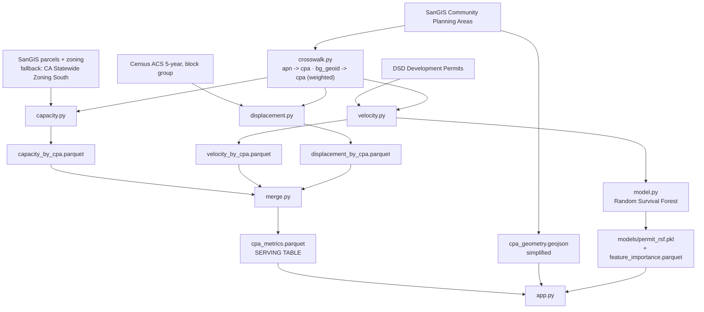

# Effective Capacity — Architecture & MVP Scope

Technical spec. Companion to `SPEC.md` (which covers execution); this document covers
**what gets built and how it is structured**.

---

## 1. What the system computes

A parcel-level model of San Diego's legally permitted-but-unbuilt housing, joined to a
permit-timing model and a household-affordability model at Community Planning Area
granularity, served as an interactive map.

The system exists to produce and let a user explore three linked quantities per CPA:

| Quantity | Definition | Layer |
|---|---|---|
| `delta_units` | Units zoning permits minus units that exist | Capacity |
| `buildout_horizon_years` | `delta_units / permits_per_year` | **Fusion** |
| `delay_cost_per_unit` | Excess permit latency priced as carrying cost | Velocity |

`buildout_horizon_years` is the only metric that cannot be computed from a single layer.
It is the system's reason for existing as one product rather than two.

---

## 2. MVP scope boundary

### In scope

- Base-zoning envelope capacity from lot area and a hand-built zone density table
- ADU/JADU and SB 9 as **post-hoc scenario multipliers**, not per-parcel rules
- Permit time-to-issuance with right-censoring (Kaplan–Meier)
- Carrying-cost model for excess delay, three parameter scenarios
- ACS-derived displacement index at CPA level
- **Interactive choropleth map** with click-to-select, metric switching, and scenario toggle
- Linked scatter view

### Explicitly not modeled in v1

| Not modeled | Consequence | Why excluded |
|---|---|---|
| Parcel-level SB 9 eligibility (lot size, prior split, owner-occupancy) | ADU/SB9 numbers are envelope estimates | Statute parsing exceeds build window |
| Setbacks, FAR, height, lot coverage | `permitted_units` is an upper bound on the density path only | Requires full development-standards table per zone |
| Parking minimums | Cannot model a parking-reform scenario honestly | No parcel-level parking requirement data |
| Overlay zones, coastal, historic, hazard | Some parcels overstated | Additional layer joins |
| Owner / assessor data | No ownership-based feasibility screen | SanGIS requires request for owner attributes |
| Economic feasibility (pro forma) | Legal capacity ≠ buildable capacity | Applied as a flat `feasibility_factor`, not per-parcel |
| Unincorporated county | City of San Diego only | CPAs are a city construct; join has no analog |

Every excluded item above must appear in the model-limitations surface of the app
(§7.7), not only in the deck.

---

## 3. System architecture



### Repository layout

```
BFFG-SD-HACKS/
├── data/
│   ├── raw/              # gitignored — parcels, permits, ACS responses
│   ├── interim/          # gitignored — cached spatial joins
│   └── processed/        # COMMITTED — kilobytes, ~50 rows each
├── ref/
│   └── zone_density.csv  # hand-built, version-controlled reference data
├── src/
│   ├── config.py         # every assumption, single source of truth
│   ├── crosswalk.py
│   ├── capacity.py
│   ├── velocity.py
│   ├── model.py          # permit duration model
│   ├── displacement.py
│   └── merge.py
├── models/               # COMMITTED — serialized model + importances
├── app/
│   ├── app.py            # entry point
│   ├── mapview.py        # choropleth + selection
│   ├── panels.py         # detail panel, stat row
│   ├── predictor.py      # single-case duration predictor
│   └── scatter.py
└── notebooks/            # exploration only — never on the pipeline path
```

### Module interface

Every pipeline module exposes one function with the same shape:

```python
def build(force: bool = False) -> pd.DataFrame:
    """Read from data/raw + data/interim, write data/processed/<name>.parquet,
    return the frame. Idempotent. Skips recompute if output exists and not force."""
```

No module imports another pipeline module. `merge.py` reads parquet files, not
functions. This keeps the four analytical layers independently runnable and
independently broken.

---

## 4. Data model

### 4.1 `cpa_crosswalk.parquet`

Two mappings, one file, long format.

```
key_type      str    "apn" | "block_group"
key           str    APN string or 12-digit BG GEOID
cpa_name      str
weight        float  1.0 for apn; areal/pop share for block_group
```

**Block groups do not nest inside CPAs.** A BG straddling two CPAs appears as two rows
whose weights sum to 1.0. See §6 for why this matters for correctness.

### 4.2 `capacity_by_cpa.parquet`

```
cpa_name            str      join key
parcels_modeled     int      parcels with a matched zone in zone_density.csv
parcels_total       int      all parcels in CPA
coverage_pct        float    parcels_modeled / parcels_total
existing_units      int      sum over modeled parcels
permitted_units     int      zoning envelope, base density only
delta_units         int      max(0, permitted_units - existing_units)   <- HEADLINE
delta_units_adu     int      delta_units + ADU/JADU scenario increment
delta_units_sb9     int      delta_units + SB9 scenario increment
delta_units_realistic int    delta_units * feasibility_factor
```

### 4.3 `velocity_by_cpa.parquet`

```
cpa_name              str
n_permits             int      permits in observation window
permits_per_year      float    n_permits / window_years        <- horizon denominator
n_units_permitted     float    nullable; null if unit counts unavailable
median_days           float    FROM THE KM CURVE, not observed rows (§5.2)
p90_days              float
pct_censored          float    share still pending at as_of_date
excess_days           float    median_days - benchmark_days
delay_cost_low        float    $/unit
delay_cost_central    float
delay_cost_high       float
```

### 4.4 `displacement_by_cpa.parquet`

```
cpa_name            str
households          int      apportioned denominator
median_hh_income    float    weighted
median_gross_rent   float    weighted
pct_burden_30       float    computed from apportioned counts, not averaged
pct_burden_50       float
pct_renter          float
risk_index          float    0-1
```

### 4.5 `feature_importance.parquet`

```
feature        str    e.g. "units", "zone_group=RM-2-5", "cpa_name=City Heights"
importance     float  permutation importance on the held-out temporal test set
direction      str    "slower" | "faster" | "mixed"
```

Permutation importance, not impurity importance. Impurity importance is biased toward
high-cardinality features, and `cpa_name` has ~50 levels — it would dominate the chart
for structural reasons rather than real ones.

### 4.6 `cpa_metrics.parquet` — serving table

The only file the app reads. Left join of the three tables on `cpa_name`, plus:

```
buildout_horizon_years   float   delta_units / permits_per_year
horizon_display          float   min(buildout_horizon_years, HORIZON_DISPLAY_CAP)
horizon_status           str     "modeled" | "no_recent_permits" | "no_capacity"
```

**Infinity handling is a serving-layer concern, not a display hack.** A CPA with
`permits_per_year == 0` has an undefined horizon. It must carry
`horizon_status = "no_recent_permits"` and render in a distinct categorical fill,
never as a max-value color — otherwise the map reads "slowest" where the truth is
"no data." Same for `delta_units == 0`.

---

## 5. Computation specs

### 5.1 Capacity

```python
permitted_units = max(1, floor(lot_sqft / lot_area_per_unit))
delta_units     = max(0, permitted_units - existing_units)
```

`lot_area_per_unit` comes from `ref/zone_density.csv`:

```
zone_code, lot_area_per_unit, source_note
RS-1-7,    5000,              "SDMC 131.0405 table"
...
```

Parcels whose zone is absent from the table are excluded from `parcels_modeled` and
from all sums. They remain in `parcels_total` so `coverage_pct` stays honest.

Scenario increments applied after aggregation, not per parcel:

```python
delta_units_adu = delta_units + (sfh_parcels * (ADU_PER_SFH + JADU_PER_SFH))
delta_units_sb9 = delta_units + (sb9_eligible_sfh_parcels * SB9_UNIT_INCREMENT)
```

### 5.2 Velocity — censoring is load-bearing

```python
event_observed = issued_date.notna()
duration       = (issued_date.fillna(AS_OF_DATE) - application_date).dt.days
```

Pending permits are **censored, not dropped**. Dropping them biases every statistic
downward, because slow permits are systematically more likely to still be pending.

For the same reason, `median_days` must be read off the Kaplan–Meier survival curve
(the duration at which S(t) = 0.5), **not** computed as the median of issued-only rows.
These differ, and the naive version is the one a judge will ask about.

```python
from lifelines import KaplanMeierFitter
kmf = KaplanMeierFitter().fit(duration, event_observed)
median_days = kmf.median_survival_time_
```

Stretch: `lifelines.CoxPHFitter` on `[project_type, units, zone_group, cpa_name]`.

### 5.3 Permit duration model

Three distinct jobs. Conflating them is the primary modeling risk in this layer.

| Job | Tool | Consumed by |
|---|---|---|
| Describe observed timelines per CPA | Kaplan–Meier (§5.2) | the choropleth |
| Attribute delay to features | Random Survival Forest | `feature_importance.parquet`, Bridge B narrative |
| Predict a single case | Random Survival Forest | the app's predictor panel |

#### Why not `RandomForestRegressor`

A plain regressor on `days_to_issue` needs a label, so it can only train on permits that
have already been issued. That discards every censored row and reproduces precisely the
bias §5.2 exists to prevent: **slow permits are systematically more likely to still be
pending, so the completed-permit training set is a biased sample of fast ones.** The model
would learn from the fast half of the distribution and under-predict on everything.

Use `sksurv.ensemble.RandomSurvivalForest` — a random forest built for right-censored
time-to-event data. Same nonparametric flexibility, same feature-importance story, no
interaction terms to specify by hand, and censoring handled correctly at every split.

```python
from sksurv.ensemble import RandomSurvivalForest
from sksurv.util import Surv
from sksurv.metrics import concordance_index_censored

y = Surv.from_arrays(event=event_observed, time=duration)

rsf = RandomSurvivalForest(
    n_estimators=300,
    min_samples_leaf=15,      # survival curves need populated leaves
    max_features="sqrt",
    n_jobs=-1,
    random_state=0,
).fit(X_train, y_train)

c_index = concordance_index_censored(
    y_test["event"], y_test["time"], rsf.predict(X_test)
)[0]
```

If `scikit-survival` will not install, the fallback is Cox PH from `lifelines`
(already a dependency) — weaker on interactions, but correct on censoring.
`RandomForestRegressor` is not a fallback.

#### Features

```
project_type        categorical
unit_count          numeric      (nullable — see §4.3)
zone_group          categorical  collapsed from zone_code
cpa_name            categorical  ~50 levels, one-hot
application_year    numeric      regime drift
application_month   numeric      seasonality
valuation           numeric      if present in the permit file
```

#### Validation

**Temporal split, never random k-fold.** Permit timelines drift with staffing, backlog,
and policy changes. Random CV leaks later regimes into the training set and inflates the
score against a model that will be read as a forecast. Train on applications before a
cutoff date, test on applications after it.

Report **Harrell's concordance index** on the held-out period. C-index is the accuracy
number that goes on screen; it is interpretable (0.5 = coin flip) and it is the metric a
statistician in the room will expect for censored data.

#### What the model is not used for

**Model predictions never color the choropleth.** Map values come from the empirical KM
medians in §5.2. If `cpa_name` is a model feature and predictions colored the map, the map
would be a smoothed restatement of its own input — circular, and it would hide the real
between-CPA variation the product exists to show.

The model produces exactly two outputs: permutation feature importance, and single-case
prediction in the app.

### 5.4 Bridge A — pricing excess delay

Benchmark is the 25th-percentile CPA across the city, not zero. Some processing time
is legitimate.

```python
benchmark_days = velocity["median_days"].quantile(0.25)
excess_days    = median_days - benchmark_days     # may be negative; keep the sign

def monthly_carry(p: CarryParams) -> float:
    return (p.land_value_per_unit * (p.cost_of_capital + p.property_tax_rate) / 12
            + p.hard_cost_per_unit * p.escalation_rate / 12)

def delay_cost(excess_days: float, p: CarryParams) -> float:
    return (excess_days / 30.44) * monthly_carry(p)
```

Only time-proportional components are included. Milestone-based costs (impact fees,
design fees) do not accrue with delay and are excluded by construction.

All three scenarios are **precomputed as three columns**. The app's scenario toggle is
a column selection, not a recomputation.

### 5.5 Fusion metric

```python
permits_per_year       = n_permits / OBSERVATION_WINDOW_YEARS
buildout_horizon_years = delta_units / permits_per_year   # guard div-by-zero -> status
```

This is a pace-normalization ("at current rates"), not a forecast. It assumes neither
that capacity will be built nor that current pace persists. Label it as such wherever
it appears in the UI.

### 5.6 Displacement index

```python
risk_index = mean([
    minmax(pct_burden_50),
    minmax(pct_renter),
    minmax(-median_hh_income),
])
```

Min-max normalized across CPAs. Deliberately simple — the construction has to be
explainable in one sentence on demand.

### 5.7 Bridge B

Weighted least squares of `excess_days` on `risk_index`, weights = `n_permits`.
Restrict to `n_permits >= MIN_PERMITS_FOR_REGRESSION`; record how many CPAs were
dropped and surface that count in the UI alongside the slope.

---

## 6. The crosswalk — apportionment correctness

The single highest-risk correctness issue in the pipeline.

**Pull ACS as counts, never as percentages.** Then apportion numerators and
denominators separately by weight, and compute the rate at CPA level:

```python
# CORRECT
burdened = (bg["burdened_hh"] * bg["weight"]).groupby(cpa).sum()
total    = (bg["total_hh"]    * bg["weight"]).groupby(cpa).sum()
pct_burden_50 = burdened / total

# WRONG — averaging rates ignores population and is biased by small block groups
pct_burden_50 = bg["pct_burden_50"].groupby(cpa).mean()
```

B25070 supplies bracket counts directly, so the correct path is also the natural one.

Medians (`median_hh_income`, `median_gross_rent`) cannot be apportioned this way.
Use a household-weighted mean of block-group medians and label the field as
approximate — it is an estimate of a median, not a median.

Parcel-to-CPA is a point-in-polygon join on parcel centroids, `weight = 1.0`. Compute
once, cache to `data/interim/`.

---

## 7. Application architecture

Single page. No tabs — tabs would present three layers as three products.

### 7.1 Layout

```
┌────────────────────────────────────────────────────────────┐
│  N unbuilt   │  Y yr horizon  │  M days  │  $X per unit    │  stat row
├──────────────────────────────────────┬─────────────────────┤
│  [horizon][capacity][excess][burden] │   Selected CPA      │  metric switch
│                                      │   ─────────────     │
│         CPA CHOROPLETH               │   beat 1 · N units  │  detail panel
│         click to select              │   beat 2 · Y years  │
│                                      │   beat 3 · $X       │
│                                      │   beat 4 · burden   │
├──────────────────────────────────────┴─────────────────────┤
│  Linked scatter · capacity × burden × permits/yr × horizon  │
├────────────────────────────────────────────────────────────┤
│  Scenario: [base|+ADU|+SB9]   Carry: [low|central|high]     │  controls
└────────────────────────────────────────────────────────────┘
```

### 7.2 State

```python
st.session_state = {
    "selected_cpa": str | None,
    "metric":       "horizon" | "capacity" | "excess_days" | "risk_index",
    "scenario":     "base" | "adu" | "sb9",
    "carry":        "low" | "central" | "high",
}
```

All four are pure selectors over precomputed columns. **No control triggers a
computation.** `scenario` and `carry` map to column names:

```python
CAPACITY_COL = {"base": "delta_units", "adu": "delta_units_adu", "sb9": "delta_units_sb9"}
CARRY_COL    = {"low": "delay_cost_low", "central": "delay_cost_central", "high": "delay_cost_high"}
```

### 7.3 Interactive map

**Rendering:** Plotly `choropleth_map` with `st.plotly_chart(..., on_select="rerun")`,
which returns selection events natively and requires no extra Streamlit component.
Fallback if selection events misbehave: `streamlit-folium`'s `st_folium`, reading
`last_object_clicked`.

**Geometry:** `data/processed/cpa_geometry.geojson` — ~50 polygons, topology-preserving
simplification, budget **under 500 KB**. Loaded once behind `@st.cache_data`. The map
never touches parcel geometry; parcels exist only in `data/interim/`.

**Interaction:**

| Event | Effect |
|---|---|
| Click polygon | sets `selected_cpa`; detail panel and scatter highlight follow |
| Click same polygon again | clears selection, returns to citywide stats |
| Hover | tooltip: CPA name + the four beat values |
| Metric switch | recolors only; selection and viewport preserved |

**Color encoding:**

| Metric | Scale | Reason |
|---|---|---|
| `horizon_display` | sequential | no meaningful midpoint |
| capacity column | sequential | no meaningful midpoint |
| `excess_days` | **diverging, centered at 0** | 0 is the benchmark — a real zero |
| `risk_index` | sequential | normalized 0–1 |

`horizon_status != "modeled"` renders as a distinct neutral hatch/fill outside the
continuous scale, with the reason in the tooltip.

No bivariate choropleth. Two-variable overlap is communicated by the scatter (§7.5),
which stays legible at projector distance where a 3×3 color grid does not.

### 7.4 Predictor panel

A single-case interface over the RSF: choose project type, unit count, zone group and CPA;
render the predicted survival curve plus the predicted median days and the Bridge A dollar
figure that follows from it.

```python
@st.cache_resource          # NOT cache_data — the model is an unserializable resource
def load_model():
    return joblib.load("models/permit_rsf.pkl")
```

This is the one place the app runs inference. It is a **single-row predict against a cached
model** — sub-millisecond, and it does not violate §7.5 because no dataframe work happens.

Every prediction must render alongside the model's held-out C-index and the phrase
"based on historical permits, not a commitment." A predicted duration presented bare will
be read as a promise.

**Fallback if model loading is fragile** (sklearn/scikit-survival version drift, file size):
precompute a prediction grid over `project_type × unit_bucket × cpa_name` into
`data/processed/prediction_grid.parquet` and make the panel a lookup. Loses continuous unit
counts; gains total runtime independence from the modeling stack.

### 7.5 Linked scatter

```
x     = delta_units per 1,000 households
y     = pct_burden_50
size  = permits_per_year
color = buildout_horizon_years
```

Shares `selected_cpa` with the map in both directions — clicking a point selects the
CPA. Upper-right quadrant (high permission, high burden) is labeled by name.

### 7.6 Performance contract

- App reads two data files — `cpa_metrics.parquet`, `cpa_geometry.geojson` — plus one
  model artifact, `models/permit_rsf.pkl`
- Data behind `@st.cache_data`; model behind `@st.cache_resource`
- Zero pandas computation in the render path beyond column selection and formatting
- Every map/scatter interaction is a re-render over ~50 rows
- The only inference is a single-row predict in the predictor panel (§7.4)

### 7.7 Model limitations surface

An always-reachable panel rendering, from data rather than hardcoded prose:

- `coverage_pct` citywide and for the selected CPA
- number of zone codes in `zone_density.csv` and share of residential parcels covered
- `pct_censored` for the selected CPA
- source vintage per dataset (`config.SOURCE_VINTAGES`)
- the §2 exclusion table
- the "at current rates" qualifier on the horizon
- Bridge B's dropped-CPA count and the ecological-inference caveat
- model C-index on the held-out temporal split, and the split date itself
- the note that model output never colors the map (§5.3)

This is part of the product, not a disclaimer. Every number it shows is derived, so it
cannot drift out of sync with the pipeline.

---

## 8. Configuration

`src/config.py` is the single source of truth for every assumption. No magic numbers
anywhere else in the codebase.

```python
from dataclasses import dataclass

@dataclass(frozen=True)
class CarryParams:
    land_value_per_unit: float
    hard_cost_per_unit:  float
    cost_of_capital:     float   # annual, blended debt+equity
    property_tax_rate:   float   # annual
    escalation_rate:     float   # annual construction cost

# TODO: source these. Placeholders — must be labeled as assumptions in the UI.
SCENARIOS = {
    "low":     CarryParams(...),
    "central": CarryParams(...),
    "high":    CarryParams(...),
}

AS_OF_DATE                 = ...    # censoring date for pending permits
OBSERVATION_WINDOW_YEARS   = ...    # denominator for permits_per_year
BENCHMARK_QUANTILE         = 0.25
FEASIBILITY_FACTOR         = ...    # legal -> realistic capacity discount
ADU_PER_SFH                = 1
JADU_PER_SFH               = 1
SB9_UNIT_INCREMENT         = ...
HORIZON_DISPLAY_CAP        = ...    # years; caps color scale, not the stored value
MIN_PERMITS_FOR_REGRESSION = 20
SOURCE_VINTAGES            = {...}  # dataset -> publication date, rendered in §7.6
```

Changing a scenario parameter must require editing exactly one file and rerunning
`merge.py` — never `velocity.py`.

---

## 9. Known correctness risks

| Risk | Where | Guard |
|---|---|---|
| Averaging rates across block groups | `displacement.py` | apportion counts, divide at CPA level (§6) |
| Median from issued-only permits | `velocity.py` | KM median, `pct_censored` reported (§5.2) |
| **RF regression trained on issued permits only** | `model.py` | Random Survival Forest, not `RandomForestRegressor` (§5.3) |
| Random k-fold leaking later permit regimes | `model.py` | temporal split; C-index on the held-out period (§5.3) |
| Impurity importance inflated by 50-level `cpa_name` | `model.py` | permutation importance on held-out data (§4.5) |
| Model predictions coloring the choropleth | `mapview.py` | map reads empirical KM medians only (§5.3) |
| Infinite horizon rendered as max color | `merge.py` / `mapview.py` | `horizon_status` categorical fill (§4.6) |
| Zone coverage silently shrinking sums | `capacity.py` | `parcels_total` retained, `coverage_pct` surfaced |
| Unweighted CPA regression | Bridge B | weight by `n_permits`, report drops (§5.7) |
| Legal capacity read as buildable | whole product | `delta_units_realistic` shown beside `delta_units` |
