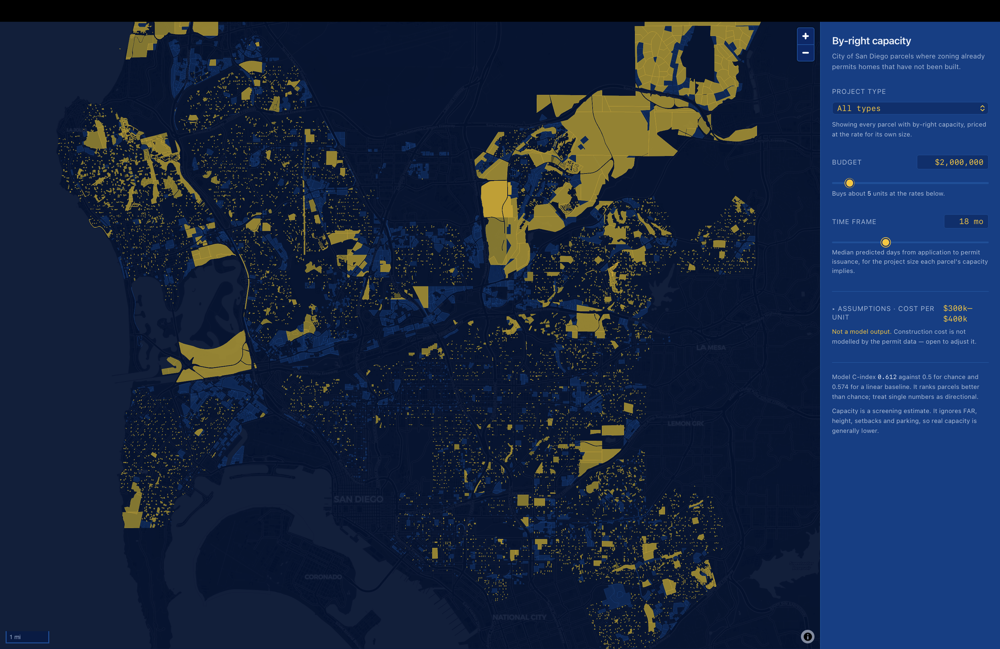
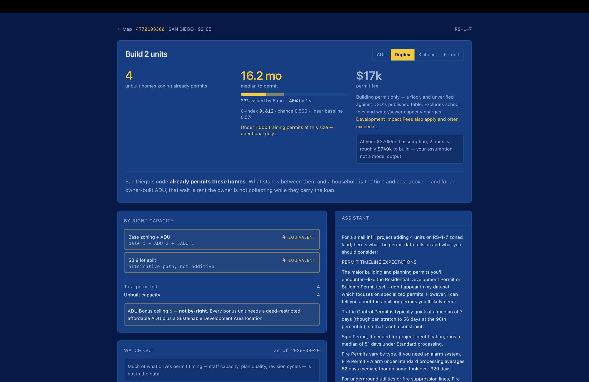

# Permit Paragons

San Diego permits housing on hundreds of thousands of parcels where nothing has
been built. This maps where that capacity is, predicts how long the city takes
to issue a permit there, and shows that the wait is not distributed evenly.

Built at the Data Science Alliance *Building for Good* hackathon, August 2026,
under the Cost-of-Living Affordability track.

---

## Presenting


---

## The application

<table>
  <tr>
    <td width="50%">
      <a href="https://d1xtsrdl1l82x1.cloudfront.net">
        
      </a>
      <br />
      Every parcel where zoning already permits homes, filtered by budget and timeframe.
    </td>
    <td width="50%">
      <a href="https://d1xtsrdl1l82x1.cloudfront.net/parcel/4770103300">
        
      </a>
      <br />
      Per parcel: capacity, predicted permit timing, fees, and a grounded assistant.
    </td>
  </tr>
</table>

**[d1xtsrdl1l82x1.cloudfront.net](https://d1xtsrdl1l82x1.cloudfront.net)**

---

## What it does

**Map.** Every City of San Diego parcel with unbuilt by-right capacity, filtered
by budget and timeframe. Filtering runs client-side against attributes baked
into the vector tiles, so moving a slider costs no network request.

**Parcel dashboard.** For any parcel: by-right capacity broken into its
competing entitlement paths, predicted permit timing for all four project
sizes, permit fees, and a retrieval-grounded assistant.

By-right capacity means zoning permits the units without discretionary review.
No approval has been granted for any specific project on any of these parcels.

---

## Model

Permit issuance is **right-censored**: about 29% of housing permits in the
dataset have not been issued yet. They are not denials — the event simply has
not been observed. A regressor trained only on issued permits fits the fast
half of the distribution and under-predicts everything.

`RandomSurvivalForest` (scikit-survival), 200 trees, `min_samples_leaf=20`.
`CoxPHSurvivalAnalysis` is fit alongside as a linear baseline.

| Model | C-index |
|---|---|
| Chance | 0.500 |
| Cox PH (linear baseline) | 0.574 |
| RandomSurvivalForest | **0.612** |

Split is **chronological**, cut at 2025-02-20. Permit rules and staffing change
over time, so a random split leaks later regulatory context backwards.

Features are restricted by a positive allowlist to what a caller actually has
at prediction time — a parcel plus a chosen project size. That deliberately
excludes valuation, floor area, and permit type, which only exist once an
application has been filed.

Outputs are read off each parcel's predicted survival curve: median days to
issuance, and issuance probability at 180 and 365 days. High quantiles are
absent on purpose — with 29% censoring the curves plateau, and p90 is undefined
for essentially every parcel.

**Not modelled.** Permit fees are a deterministic lookup from the published fee
schedule. Capacity is rule-based, transcribed from the municipal code.
Construction cost is not modelled at all; the map's cost figure is a stated
assumption, adjustable in the UI and labelled as not a model output.

---

## Data

| Source | Contributes |
|---|---|
| DSD Development Permits | permit dates, status, dwelling-unit counts |
| SANDAG Regional Parcels | APN, geometry, area, existing units |
| City of San Diego zoning | base zone polygons |
| Coastal Overlay Zone | coastal permit jurisdiction |
| Municipal Code Ch.13 / §141.0302 | by-right density, ADU and JADU counts |
| DSD IB-501 Table 501A | permit fee rates |

Joined on APN. Coverage is the **City of San Diego only** — 393,755 of the
county's ~1.09M parcels fall inside a City zoning polygon. DSD permit data does
not cover unincorporated county.

Two outputs feed the application:

- `data/predictions.parquet` — 1,575,020 rows, one per parcel × project size
- `data/parcels_tile_attributes.parquet` — 393,755 rows, widened for the tile build

---

## Architecture

```
Browser
  ├── parcels.pmtiles ──── S3 + CloudFront, HTTP range requests
  └── /api/* ───────────── CloudFront → ALB → Fargate → FastAPI
                                                  ├── predictions.parquet (in memory)
                                                  └── Claude + permit_type_stats.csv
```

**Frontend.** React 19, TypeScript, Vite. MapLibre GL renders parcels from a
single 73 MB PMTiles archive served as static object storage — the client pulls
byte ranges, never the whole file. Two independent feature slices (`map`,
`insights`) behind a router-only shell; they never import each other and
communicate through the URL. Enforced by `frontend/scripts/check-boundaries.mjs`,
which runs as part of the build.

**Server.** FastAPI, no database. One process loads the predictions frame into
memory at startup and serves reads off it.

| Endpoint | Purpose |
|---|---|
| `POST /search` | filter parcels by project size, fee and timeframe |
| `POST /parcel-detail` | attributes, capacity, all four predictions, model info |
| `POST /parcel-rag` | narrative context, split out so it cannot block the page |
| `POST /rag/chat` | free-text permit Q&A |
| `WS /ws/rag/chat` | multi-turn version, keeps conversation state |
| `GET /model-info` | C-index, as-of date, row counts |
| `GET /health` | liveness |

**Assistant.** Keyword retrieval over `permit_type_stats.csv` plus one Claude
call. No vector store — retrieval is exact-match scoring over 112 rows of
closed-approval statistics. Parcel facts and model figures are injected into the
prompt rather than retrieved, so the model never infers a duration.

**Infrastructure.** CloudFormation in `infra/`. GitHub Actions deploys on push
to `main`, authenticated by OIDC — no AWS keys exist in the repository or in
GitHub secrets.

---

## Running it

```bash
# Server
cd server
python3 -m venv venv && source venv/bin/activate
pip install -r requirements.txt        # pyarrow>=25 is required
cp .env.example .env                   # set ANTHROPIC_API_KEY
uvicorn main:app --reload

# Frontend
cd frontend
npm install
echo "VITE_TILES_URL=/parcels.pmtiles" > .env
npm run dev
```

Startup loads a 42 MB parquet and takes roughly 14 seconds. Without
`ANTHROPIC_API_KEY` the assistant returns a labelled placeholder rather than
failing.

Deployment: `infra/README.md`.

---

## Limitations

**Capacity is a screening estimate, not an entitlement determination.** It
applies base density, ADU/JADU and SB 9 rules but ignores FAR, height, setbacks
and parking, and cannot see historic districts, fire hazard zones or tenancy
history. Real capacity is generally lower than shown.

**The model is modest.** C-index 0.612 against 0.500 for chance. It ranks
parcels better than chance, but much of what drives permit timing — staff
capacity, plan quality, revision cycles — is not in the data. Duplex and 3-4
unit each have under 1,000 training rows and should be treated as directional.

**Permit fees are a floor.** Building permit only. They exclude Development
Impact Fees, school fees, and water and sewer capacity charges, which together
often exceed the permit itself.

**Findings are correlational.** Timing differences across areas describe the
data; they do not establish cause.

**This tool could widen the gap it documents.** Showing which areas clear
permits quickly can steer capital toward them and away from the underserved
areas that are slowest. The intended use is the opposite — evidence for
expediting review where it is slowest.

---

## Team

Brandon, Dom, Ajay, Jake, Alex, Ryn, Kevin
